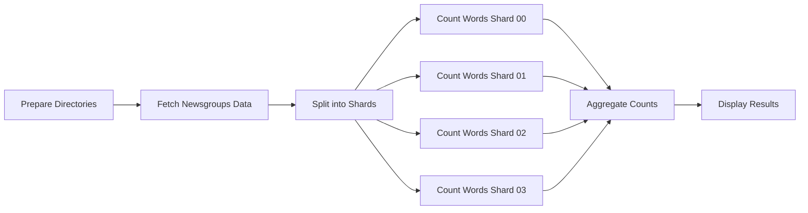

# Airflow Lab 03 - Word Count Pipeline

## Project Overview

This is an Apache Airflow project that implements a distributed word counting pipeline using the 20 Newsgroups dataset. The project demonstrates parallel processing, data sharding, and result aggregation using Airflow's task orchestration capabilities.

The pipeline processes text data by:
1. Fetching and cleaning newsgroup documents
2. Splitting data into parallel processing shards
3. Counting words in each shard concurrently
4. Aggregating results into a final word frequency table

## Project Structure

```
airflow-lab-03/
├── ex1/                     # Exercise 1 - Main implementation
│   ├── dags/               # DAG definitions and task implementations
│   │   ├── count_words_dag.py     # Main DAG definition
│   │   └── tasks/                 # Task implementations
│   │       ├── fetch_newsgroups.py     # Download and clean newsgroup data
│   │       ├── prepare_dirs.py         # Setup output directories
│   │       ├── split_into_shards.py    # Split data into parallel chunks
│   │       ├── count_words_shard.py    # Count words in individual shards
│   │       └── aggregate_counts.py     # Merge shard results
│   ├── config/            # Airflow configuration files
│   ├── logs/              # Airflow logs
│   ├── output/            # Pipeline output files (git-ignored)
│   ├── plugins/           # Custom Airflow plugins
│   ├── docker-compose.yaml # Service orchestration
│   └── Dockerfile         # Custom Airflow image
├── ex2/                   # Exercise 2 (similar structure to ex1)
├── shared/                # Shared resources
│   ├── src/               # Shared source code (currently empty)
│   └── pyproject.toml     # Python project configuration
├── .gitignore             # Git ignore patterns
├── README.md              # Project documentation
└── uv.lock                # Python dependency lock file
```

## Architecture

The pipeline uses a **CeleryExecutor** setup with:
- **PostgreSQL** - Database backend for Airflow metadata
- **Redis** - Message broker for Celery workers
- **Docker Compose** - Container orchestration
- **Parallel Processing** - Multiple concurrent word counting tasks

## Pipeline Workflow



### Task Details

- **prepare_dirs**: Creates necessary output directories
- **fetch_newsgroups**: Downloads 20 Newsgroups dataset, removes stopwords, and cleans text
- **split_into_shards**: Divides corpus into 4 equal parts for parallel processing
- **count_words_shard_X**: Parallel tasks that count word frequencies in each shard
- **aggregate_counts**: Merges word counts from all shards
- **display_results**: Shows final statistics and top words

## 📋 Prerequisites

- Docker and Docker Compose
- At least 4GB RAM
- At least 2 CPU cores
- 10GB+ disk space

## 🚀 Quick Start

1. **Set up environment**
   ```bash
   echo "AIRFLOW_UID=$(id -u)" > .env
   ```

2. **Start the services**
   ```bash
   cd ex1
   docker-compose up -d
   ```

3. **Access Airflow Web UI**
   - URL: http://localhost:8080
   - Username: `airflow`
   - Password: `airflow`

4. **Run the DAG**
   - Navigate to the `count_words_dag` in the UI
   - Enable and trigger the DAG

## 📊 Output Files

The pipeline generates:
- `output/corpus.txt` - Cleaned newsgroup documents (one per line)
- `output/meta.tsv` - Document metadata with categories
- `output/shard_XX.txt` - Individual data shards
- `output/word_counts_XX.tsv` - Word counts per shard
- `output/word_counts.tsv` - Final aggregated word frequencies

## 🛠️ Configuration

### Environment Variables

Key variables in `docker-compose.yaml`:
- `AIRFLOW_UID` - User ID for file permissions
- `_AIRFLOW_WWW_USER_USERNAME/PASSWORD` - Web UI credentials
- Database and Redis connection strings

### Customization

Modify `dags/count_words_dag.py` to:
- Change number of shards (default: 4)
- Adjust newsgroup categories
- Modify text cleaning parameters

## 📝 Dependencies

- **Apache Airflow** >= 3.0.6
- **scikit-learn** >= 1.0.0 (for 20 Newsgroups dataset)
- **PostgreSQL** 13
- **Redis** 7.2-bookworm

Dependencies are managed through:
- `shared/pyproject.toml` - Project-level dependencies
- `ex1/Dockerfile` - Custom image with additional packages
- `uv.lock` - Lock file for deterministic builds

## 🔧 Development Commands

1. **Build custom image**
   ```bash
   cd ex1
   docker-compose build
   ```

2. **Monitor services**
   ```bash
   cd ex1
   docker-compose ps
   docker-compose logs airflow-webserver
   ```

3. **Troubleshooting**
   ```bash
   # Fix permission errors
   echo "AIRFLOW_UID=$(id -u)" > .env
   docker-compose down -v
   docker-compose up -d
   ```

## 📈 Monitoring

- **Airflow Web UI**: http://localhost:8080
- **Flower** (Celery monitoring): http://localhost:5555 (with `--profile flower`)

## Development Conventions

1. **Task Implementation**: Each task is implemented as a separate Python file in the `dags/tasks/` directory
2. **DAG Structure**: Uses Airflow decorators (`@dag`, `@task`) for clean workflow definition
3. **Task Grouping**: Related tasks are grouped using `@task_group` decorator
4. **Path Management**: All file operations use the base path `/opt/airflow` as configured in the Docker setup
5. **Error Handling**: Tasks include appropriate error handling for missing files and edge cases
6. **Output Format**: Results are saved in TSV format for easy consumption

## 🐛 Troubleshooting

### Common Issues

1. **Permission Errors**
   ```bash
   echo "AIRFLOW_UID=$(id -u)" > .env
   docker-compose down -v
   docker-compose up -d
   ```

2. **Memory Issues**
   - Ensure at least 4GB RAM available
   - Reduce number of shards if needed

3. **Port Conflicts**
   - Check if port 8080 is available
   - Modify port mapping in `docker-compose.yaml`

## 🤝 Contributing

1. Fork the repository
2. Create a feature branch
3. Make your changes
4. Test the pipeline
5. Submit a pull request